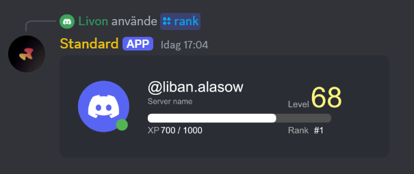

# RankCard

#### Simple Usuage

```javascript
let card = new RankCard({ interaction: interaction })
let attachment = await card.load()
```

#### Full usuage

```javascript
let exampleCard = new RankCard({
      interaction: interaction, // required
      profilePicture: myProfilePicture,
      title: myTitle,
      description: myDescription,
      level: myLevel,
      xp: myXP,
      xpGoal: myXpGoal,
      rank: myRank,
      backgroundImage: myBackgroundImage,
      status: myStatus // online, offline, idle or dnd
})

let attachment = await exampleCard.load() // waits for promise to resolve
```

#### Showcase

<figure><figcaption></figcaption></figure>

